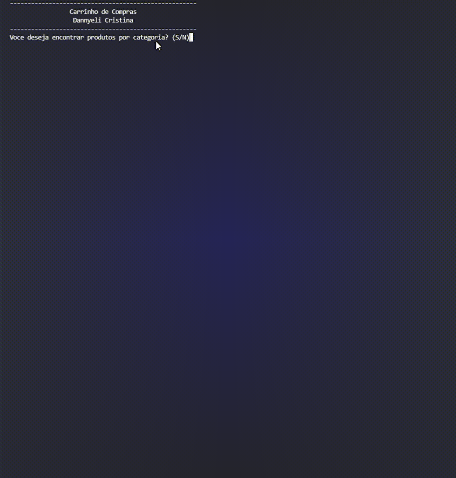

## Lógica aplicada - Aula de revisão

``O conteúdo aborbado na aula de revisão da semana 05, teve ênfase em todos os assuntos dados nas últimas 4 semanas.``

 ### **Exercício proposto da semana 05:**
- Criar um sistema para um carrinho de compras.

  > Passo a passo: 
  
- Iniciar o pedido do cliente com opções de navegar por categoria ou ID;

- Solicitar o ID desejado, que corresponde ao produto listado;

- Solicitar a quantidade desejada de produtos;

- Estabelecer uma estrutura de repetição, caso o cliente desejar acrescentar mais produtos no carrinho;

- Após encerrar o pedido, solicitar o cupom de desconto;

- Desenvolver a lógica, a partir disso.

  > Validação: 
  
- Caso o ID seja inválido, apresentar uma mensagem de erro e solicitar um novo ID;
- Caso a quantidade digitada seja um número < 0, apresentar uma mensagem de erro e solicitar um número válido;
- Caso o cupom seja > 15%, apresentar uma mensagem de erro e solicitar um cupom válido.

  > Classe:
  
 - Criar uma classe que contém no `constructor` as seguintes informações:
   - Quantidade de produtos;
   - Valor de desconto;
   - Valor total.
   
   > Resolução: 
   
  
` Deve-se calcular a quantidade de produtos adicionados ao carrinho pelo preço unitário correspondente e subtraí-lo ao valor do desconto `

---
 ### **E este foi o resultado final ✨**
 

---
  
 #### Connect with me:
 

  
  

